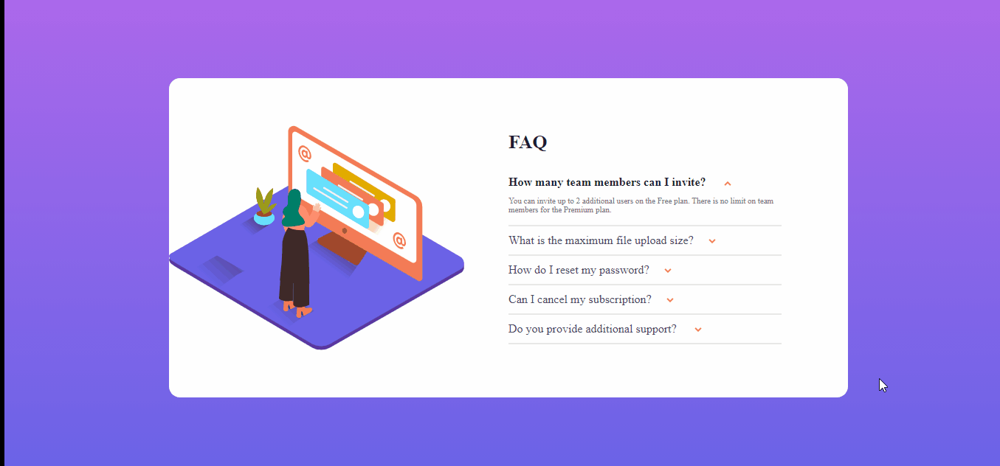
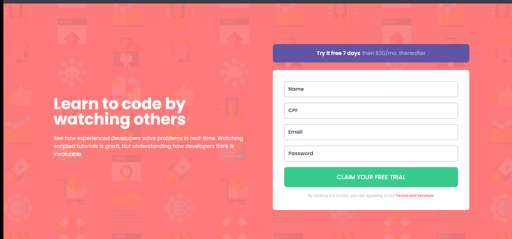

## Frontend-Mentor-Challenges

 

Repositório com desafios resolvidos tirados do site: front-end mentor utilizando HTML, CSS e Javascript.

<h2> Primeiro Desafio </h2>

Nesse desafio, o javascript foi responsável por mostrar a resposta quando o usuário clicasse na pergunta.

<h2> Segundo Desafio </h2>

Nesse desafio, o javascript foi responsável por mostrar os icones das redes sociais ao clicar no botão

<h2> Terceiro Desafio </h2>

Nesse desafio, o objetivo era criar um formulário de cadastro com uma validação.

A validação foi feita através do javascript utilizando class e regex para verificar se os campos de cpf e e-mail estavam com valores válidos.

<h2> Como Utilizar </h2>

 Caso tenha o git baixado no seu computador, só precisa clonar esse repositório, se não tiver é necessário que o repositório seja baixado.

 Utilizando o vs code, você pode acessar qualquer um desses desafios através da extensão: live server. 

<h2> Autor </h2>

 Hamilton de Souza 

